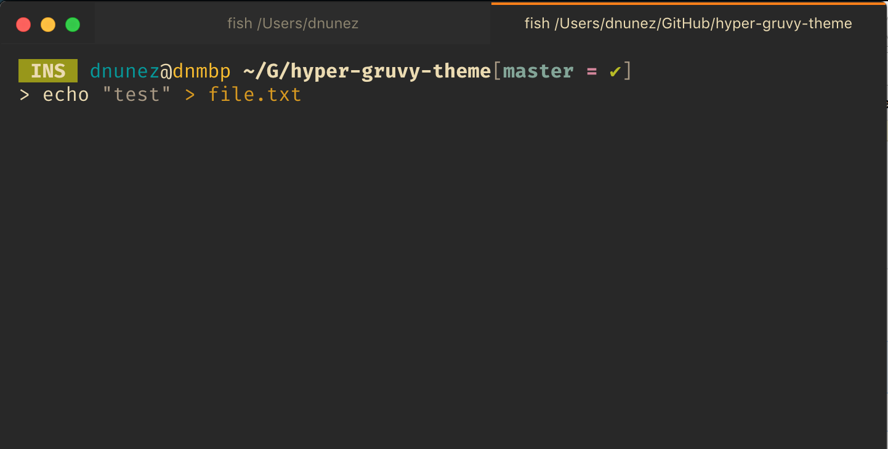

# Hyper Terminal Gruvy Theme

[Hyper] terminal theme based on [Gruvbox] color scheme



## Installation

```bash
hpm install hyper-gruvy-theme
```

## Configuration Options

* `themeBackgroundMode`: `light`, `dark` (default)
* `themeContrastMode`: `soft`, `normal` (default), `hard`

[Hyper]: https://hyper.is
[Gruvbox]: https://github.com/morhetz/gruvbox
